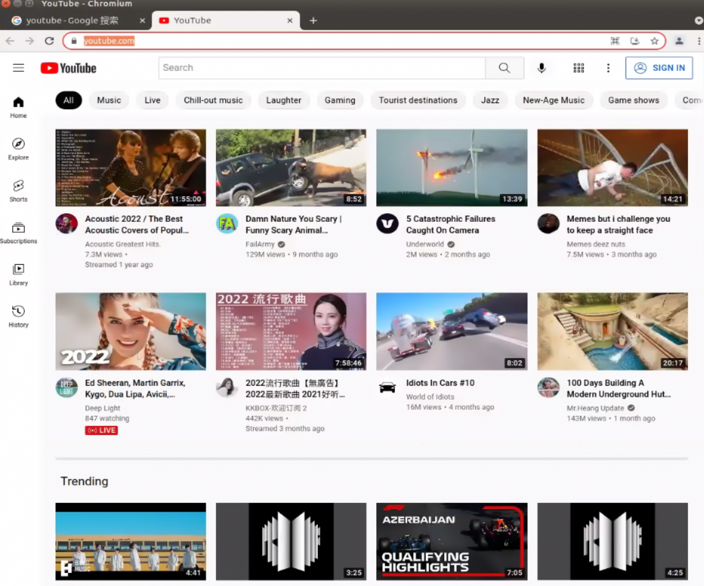

# jetson nano environment configuration (updating ...)


[TOC]


## 一.卡刷

### 1.将TF卡格式化

### 2.使用Etcher刷入镜像(15min左右、时间紧张可跳过验证阶段)


## 二.刷固件

### 1.将jetson nano 调整至recovery模式

将开发板上的GND和FC REC两个管脚用杜邦线连接，开机即可进入recovery模式  -- jetson nano 可不用此步骤，TX2需要

### 2.刷固件(用ubuntu或者虚拟机镜像)

将开发板通过micro usb-usb线连接笔记本上，打开虚拟机，找到home/Linux_for_Tegra，并进入，打开terminal

执行命令

```bash
sudo ./flash.sh -r jetson-nano-devkit-emmc mmcblk0p1
```


## 三.TF卡扩容

开发板连接好屏幕、键盘、鼠标、网线等   p3450 不用执行这一步

打开开发板Ubuntu的terminal，输入:

```bash
sudo apt-get install gparted
```

在右上角选择tf卡(例如:.dev/sda (29.72GiB)  这个通过容量就会很好判断 )

点击第一个分区，右键选择resize 将为未被分配的空间添加上即可

以32G tf卡为例，添加完 系统的/home 可到16GB+


## 四.安装nomachine(远程控制软件 可不选、直接连鼠标键盘操作)

[nomachine ARM版链接](https://www.nomachine.com/download/download&id=116&s=ARM)

下载后，进入download文件夹，打开terminal 输入

```bash
sudo dpkg -i nomachine_7.9.2_1_arm64.deb
```

安装后，window端下载nomachine，两台设备在同一个局域网中，输入用户名密码，即可远程访问


## 五.安装jtop

1.安装pip3

```bash
sudo apt install python3-pip
```

2.使用pip3安装jtop

```bash
sudo pip3 install -U jetson-stats
```

注:下载时候可能需要挂vpn(用校园网不需要挂vpn)，此处可采用局域网代理解决，具体操作如下: 

1)在window端打开clash的局域网代理，如下图：


2)在jetson 端


3)验证

在浏览器中输入https://www.youtube.com/



得到上述界面即代表成功。

3.使用jtop

```bash
sudo jtop
```

现象如下:


## 六.检查已经安装的组件

### 1）启动CUDA

​	在环境变量中添加CUDA的安装地址

```bash
sudo gedit  ~/.bashrc
```

在`.bashrc`文件中添加以下几行

```bash
export CUDA_HOME=/usr/local/cuda
export LD_LIBRARY_PATH=/usr/local/cuda/lib64:$LD_LIBRARY_PATH
export PATH=/usr/local/cuda/bin:$PATH
```

保存之后，别忘了使其生效

```bash
source ~/.bashrc
```

然后在执行`nvcc -V`，会得到以下结果：


## 七.安装opencv cuda

### 1.查看opnecv信息

刷完机后，输入`jetson_release`以查看Opencv版本和是否使用了CUDA(compiled CUDA)

```bash
jetson_release
```


可以注意到 compiled CUDA的選項是 NO，所以我們需要耗費一點時間來重建 OpenCV。

### 2.增大交换空间(Add swap RAM)

因为Jetson nano的内存只有4GB，且与显存共用，后期编译torchvision，生成TensorRT推理引擎文件不够用，这里通过增加swap内存的方法来解决这个问题。

```bash
sudo vim /etc/systemd/nvzramconfig.sh
```

按“i”进入输入模式，如图所示，修改

`mem=$((("${totalmem}" / 2 / "${NRDEVICES}") * 1024))`为`mem=$((("${totalmem}" * 2 / "${NRDEVICES}") * 1024))`

按"Esc"输入“:wq”保存退出，重启板子。


### 3.準備 OpenCV source code

以OpenCV 4.1.1为例:

```bash
# download the latest version
cd ~
wget -O opencv.zip https://github.com/opencv/opencv/archive/4.1.1.zip
wget -O opencv_contrib.zip https://github.com/opencv/opencv_contrib/archive/4.1.1.zip

# unpack
unzip opencv.zip
unzip opencv_contrib.zip

# some administration to make live easier later on
mv opencv-4.1.1 opencv
mv opencv_contrib-4.1.1 opencv_contrib

# clean up the zip files
rm opencv.zip
rm opencv_contrib.zip
```

### 4.準備 Build 的參數

```bash
cd ~/opencv
mkdir build
cd build
```

由於系統環境預設使用 python2，我實際 build 的時候發現 cmake 會抓不到 python3 的路徑，所以只 build 出 python2 的 OpenCV。因此我們在 build 之前先做一個手腳，把 python 這道指令重新指向 python3 的 bin，讓預設變成 python3，這樣就能抓到。

```bash
# 先查詢目前 python 的位置
$ which python
/usr/bin/python
$ which python3
/usr/bin/python3

# 把 python 重新指向 python3
$ sudo ln -s /usr/bin/python /usr/bin/python3
```

這邊注意 OPENCV_EXTRA_MODULES_PATH 路徑要給對，要指向剛剛下載解壓的 opencv_contrib 資料夾路徑。如果位置不同務必要自行調整。

```bash
cmake -D CMAKE_BUILD_TYPE=RELEASE \
-D CMAKE_INSTALL_PREFIX=/usr \
-D OPENCV_EXTRA_MODULES_PATH=~/opencv_contrib/modules \
-D EIGEN_INCLUDE_PATH=/usr/include/eigen3 \
-D WITH_OPENCL=OFF \
-D WITH_CUDA=ON \
-D CUDA_ARCH_BIN=5.3 \
-D CUDA_ARCH_PTX="" \
-D WITH_CUDNN=ON \
-D WITH_CUBLAS=ON \
-D ENABLE_FAST_MATH=ON \
-D CUDA_FAST_MATH=ON \
-D OPENCV_DNN_CUDA=ON \
-D ENABLE_NEON=ON \
-D WITH_QT=OFF \
-D WITH_OPENMP=ON \
-D WITH_OPENGL=ON \
-D BUILD_TIFF=ON \
-D WITH_FFMPEG=ON \
-D WITH_GSTREAMER=ON \
-D WITH_TBB=ON \
-D BUILD_TBB=ON \
-D BUILD_TESTS=OFF \
-D WITH_EIGEN=ON \
-D WITH_V4L=ON \
-D WITH_LIBV4L=ON \
-D OPENCV_ENABLE_NONFREE=ON \
-D INSTALL_C_EXAMPLES=OFF \
-D INSTALL_PYTHON_EXAMPLES=OFF \
-D BUILD_opencv_python3=TRUE \
-D OPENCV_GENERATE_PKGCONFIG=ON \
-D BUILD_EXAMPLES=OFF ..
```

跑完時，務必看 cmake 跑出來的 log 檢查有沒有抓到 python3


### 5.start Build 

此过程时间较长，请耐心等待

```bash
make -j4
```

### 6.安裝 OpenCV

```bash
sudo rm -r /usr/include/opencv4/opencv2
sudo make install
sudo ldconfig
```

### 7.测试安装是否成功

```bash
sudo rm -r /usr/include/opencv4/opencv2
sudo make install
sudo ldconfig
```

立刻測試一下有沒有安裝成功

```python
>>> import cv2
>>> cv2.__version__
'4.5.0'
```

檢查有沒有 support CUDA & GStreamer

```python
>>> print(cv2.getBuildInformation())
```

如果出現以下訊息就代表成功！


也可以用jtop的info tab来确认


## 八.deepstream

官方link:https://developer.nvidia.com/embedded/deepstream-on-jetson-downloads-archived

jetpack 4.6.1搭配 deepstream-6.0.1 

JetPack 4.5.1搭配 deepstream-6.0.1 

```bash
sudo apt-get install -f
```

```bash
sudo dpkg -i deepstream-6.0_6.0.1-1_arm64.deb
```

檢測是否安裝成功：

```bash
deepstream-app --version-all
```

效果圖如下，即為成功


安裝參考例程：https://blog.csdn.net/m0_37605642/article/details/122648297


----------

```bash
cd /opt/nvidia/deepstream/deepstream-6.0/sources/objectDetector_Yolo
```

编辑文件prebuild.sh，注释掉除yolov3-tiny的语句  

```bash
./prebuild.sh
```

可能會出現如下現象:

```bash
deepstream-app: error while loading shared libraries: libgstrtspserver-1.0.so.0: cannot open shared object file: No such file or directory
```

可能会出现这种错误 libgstrtspserver-1.0.so.0没有，也就是找不到，或者没装;

安裝依賴，命令如下:

```
sudo apt install \
    libssl1.0.0 \
    libgstreamer1.0-0 \
    gstreamer1.0-tools \
    gstreamer1.0-plugins-good \
    gstreamer1.0-plugins-bad \
    gstreamer1.0-plugins-ugly \
    gstreamer1.0-libav \
    libgstrtspserver-1.0-0 \
    libjansson4
```

下載完yolov3-tiny.cfg和yolo3-tiny.weights

執行命令:

```
deepstream-app -c deepstream_app_config_yoloV3_tiny.txt
```


## 附錄:

### 1.风扇自动控制

 1)Download script

```bash
git clone https://github.com/Pyrestone/jetson-fan-ctl.git
```

2)install

```bash
cd jetson-fan-ctl
# 安装
sudo ./install.sh 
# 下次重新启动后应用
sudo service automagic-fan restart
# 如果您怀疑出现问题，请检查
sudo service automagic-fan status
```


## 問題匯總:

### Q1:

```bash
dpkg: error processing package nvidia-l4t-initrd (--configure):
 dependency problems - leaving unconfigured
Errors were encountered while processing:
 nvidia-l4t-bootloader
 nvidia-l4t-xusb-firmware
 nvidia-l4t-initrd
E: Sub-process /usr/bin/dpkg returned an error code (1)
```


