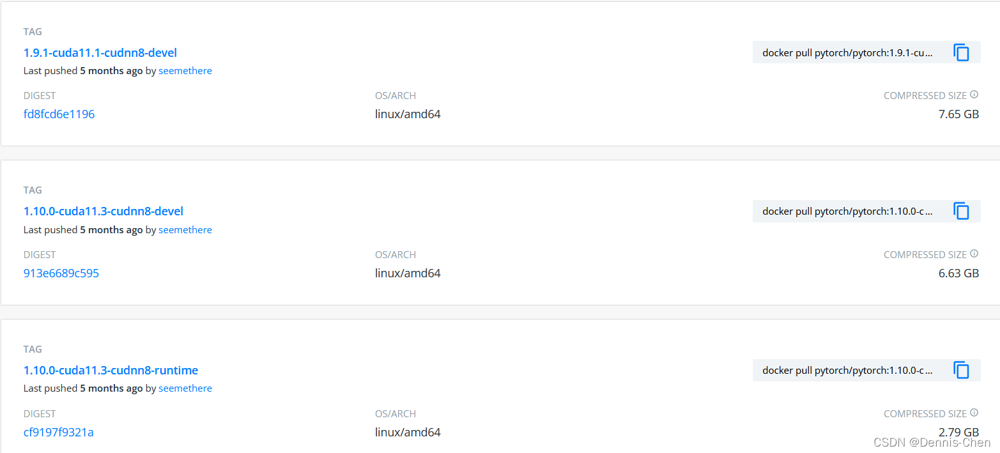
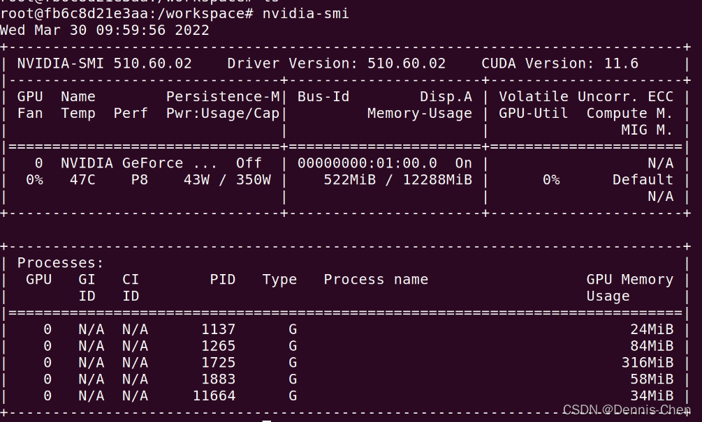
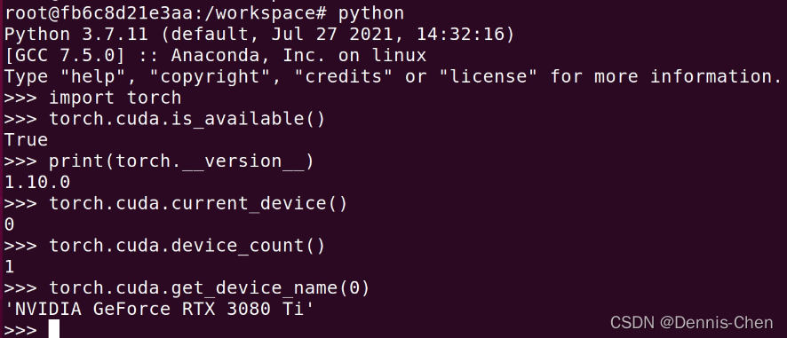
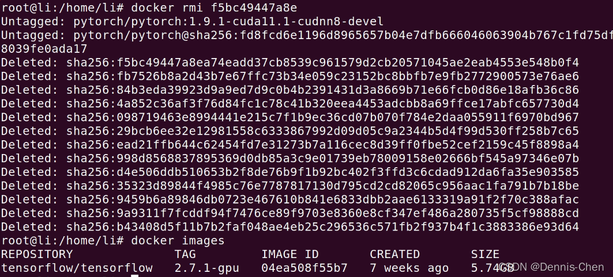
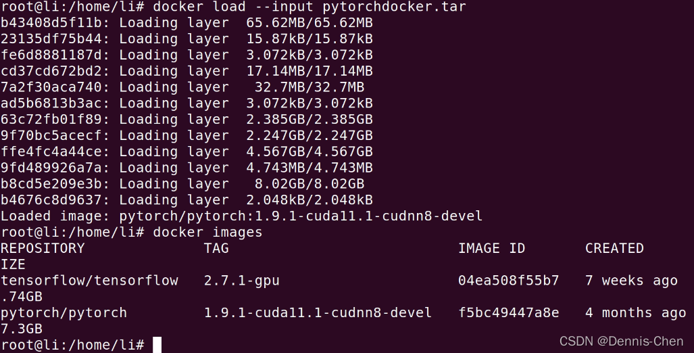

# 使用docker安裝GPU版pytorch

## **1.在docker pytorch 網址找到自己需要的環境(網址:https://hub.docker.com/r/pytorch/pytorch/tags)**




点击复制 devel 版 连接
(此处以 docker pull pytorch/pytorch:1.9.1-cuda11.1-cudnn8-devel 为例)

## 2.打开Ubuntu terminal

从镜像仓库中拉取或者更新指定镜像

```bash
 docker pull pytorch/pytorch:1.9.1-cuda11.1-cudnn8-devel
```

有了镜像才可以创建容器，创建一个新的容器并运行镜像

```ba
docker run -it --name="cuda" --gpus=all pytorch/pytorch:1.9.1-cuda11.1-cudnn8-devel /bin/bash 
```

(各参数意思自行百度)


验证:







## 3.从宿主机拷文件到docker容器里面

> docker cp 要拷贝的文件路径 容器名：要拷贝到容器里面对应的路径

例:

```bash
docker cp /media/li/data/ch/pytorch_classification fb6c8d21e3aa:/media/
```


## 4.docker保存、删除、导入镜像

### 4.1 保存

例:

```bash
docker save -o pytorchdocker.tar pytorch/pytorch:1.9.1-cuda11.1-cudnn8-devel
```


> ##-o：指定保存的镜像的名字；rocketmq.tar：保存到本地的镜像名称；rocketmq：镜像名字，通过"docker images"查看

### 4.2 删除 容器 

```bash
docker rm fb6c8d21e3aa
```


### 4.3 **删除镜像**




### 4.4 **导入 镜像**

```bash
 docker load --input pytorchdocker.tar 
```



(更新中)


註:

> 1.docker 基礎命令 : https://www.runoob.com/docker/docker-command-manual.html
>
> 2.镜像和容器的区别 : https://blog.csdn.net/weixin_51297617/article/details/122529754?spm=1001.2101.3001.6650.12&utm_medium=distribute.pc_relevant.none-task-blog-2~default~BlogCommendFromBaidu~Rate-12.pc_relevant_paycolumn_v3&depth_1-utm_source=distribute.pc_relevant.none-task-blog-2~default~BlogCommendFromBaidu~Rate-12.pc_relevant_paycolumn_v3&utm_relevant_index=17