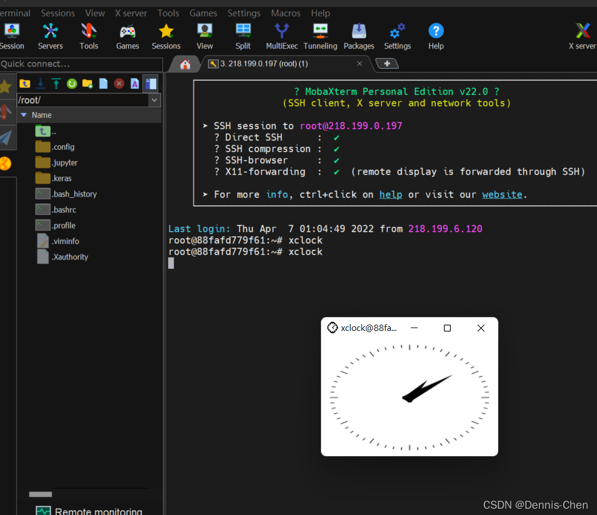
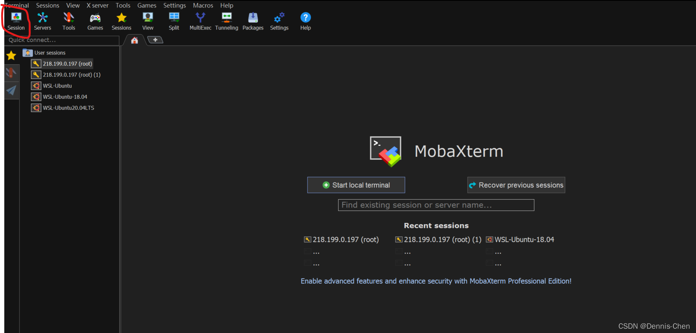
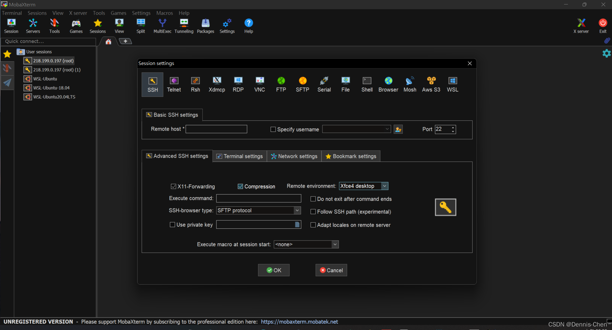
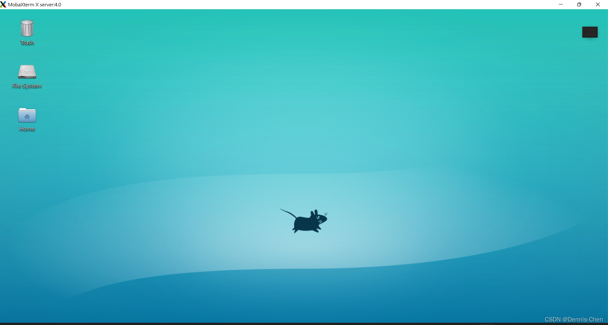
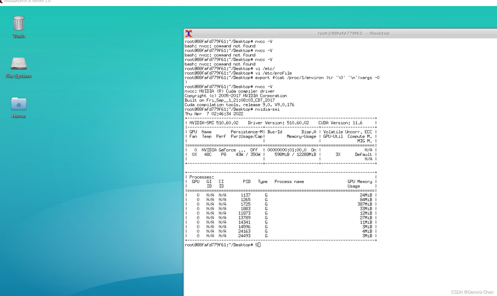

# Docker container display graphic to the host screen

## Docker容器显示图形到宿主机屏幕

## 在 docker 内

```bash
apt install xorg # ubuntu; for centos, xorg-x11-xauth* 

touch /root/.Xauthority 

xauth add localhost/unix:10 MIT-MAGIC-COOKIE-1 $(mcookie)
```


## 修改 /etc/ssh/sshd_config

```bash
vi  /etc/ssh/sshd_config
```

```bash
# AddressFamily any* 

AddressFamily inet 

AllowTcpForwarding yes 

X11Forwarding yes 

X11DisplayOffset 10 

X11UseLocalhost yes
```

## 在dockers中重启服务

```bash
service ssh restart
```


## 在客户端运行一下

```bash
xclock
```


## 即可得到如下现象:



## 安装Xfce4

```bash
//更新系统
apt-get update && apt-get upgrade -y
//安装xfce4
apt-get install xorg xdm xfce4
```


## 客户端 – 使用MobaXterm

### 1.点击session



### 2.选择SSH 填入ip，username，port

### Remote environment 选择 Xfce4 deskto



### 3.即可得到如下的图形化界面



