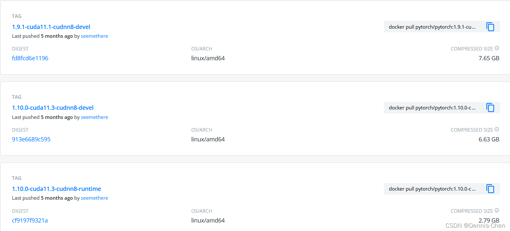
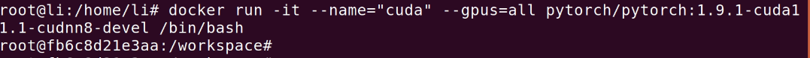
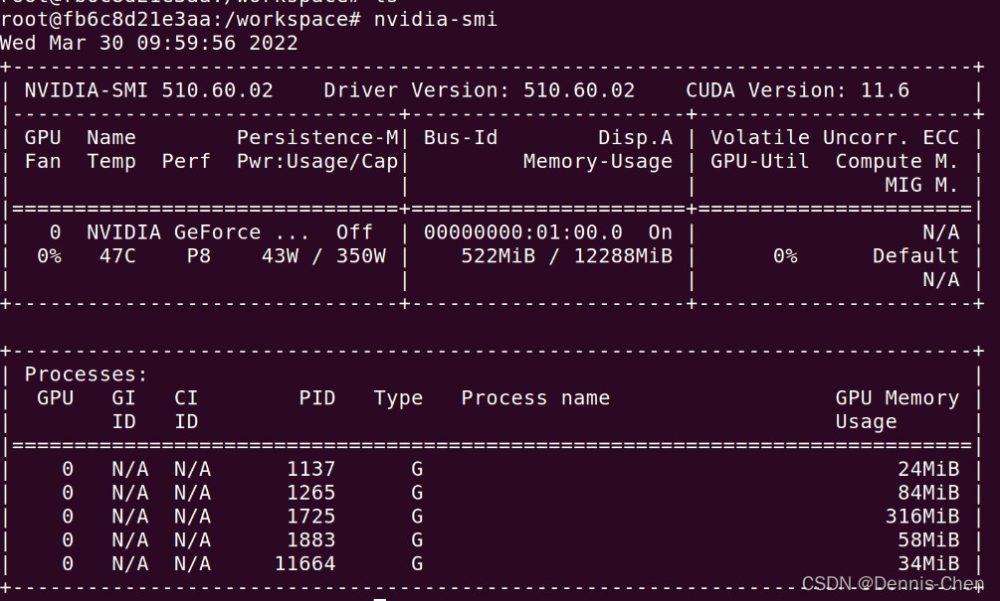

# 使用docker安裝GPU版pytorch

## **1.在docker pytorch 網址找到自己需要的環境(網址:https://hub.docker.com/r/pytorch/pytorch/tags)**




点击复制 devel 版 连接
(此处以 docker pull pytorch/pytorch:1.9.1-cuda11.1-cudnn8-devel 为例)

## 2.打开Ubuntu terminal

从镜像仓库中拉取或者更新指定镜像

```bash
 docker pull pytorch/pytorch:1.9.1-cuda11.1-cudnn8-devel
```

有了镜像才可以创建容器，创建一个新的容器并运行镜像

```ba
docker run -it --name="cuda" --gpus=all pytorch/pytorch:1.9.1-cuda11.1-cudnn8-devel /bin/bash 
```

(各参数意思自行百度)


验证:




3. 从宿主机拷文件到docker容器里面
docker cp 要拷贝的文件路径 容器名：要拷贝到容器里面对应的路径

例:

docker cp /media/li/data/ch/pytorch_classification fb6c8d21e3aa:/media/
1


4. docker保存、删除、导入镜像
4.1 保存
例:

docker save -o pytorchdocker.tar pytorch/pytorch:1.9.1-cuda11.1-cudnn8-devel
1
##-o：指定保存的镜像的名字；rocketmq.tar：保存到本地的镜像名称；rocketmq：镜像名字，通过"docker images"查看


删除 容器
例:

docker rm fb6c8d21e3aa
1

删除镜像


导入 镜像

 docker load --input pytorchdocker.tar 
1


(更新中)

註:

1.docker 基礎命令
2.镜像和容器的区别
————————————————
版权声明：本文为CSDN博主「Dennis-Chen」的原创文章，遵循CC 4.0 BY-SA版权协议，转载请附上原文出处链接及本声明。
原文链接：https://blog.csdn.net/qq_37759113/article/details/123851188