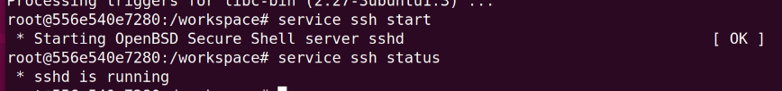
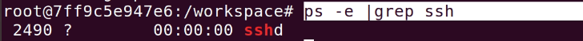
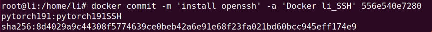
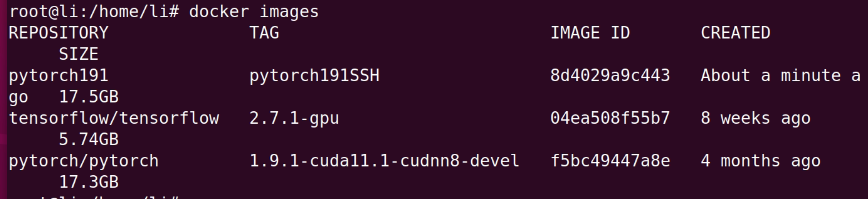
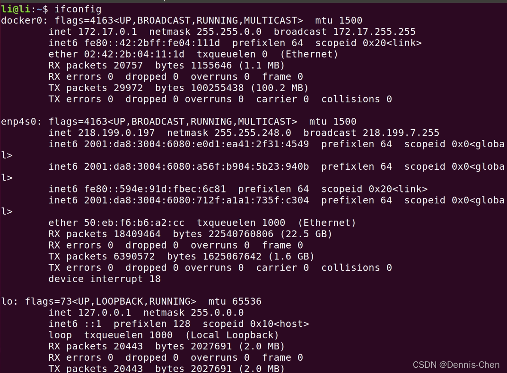
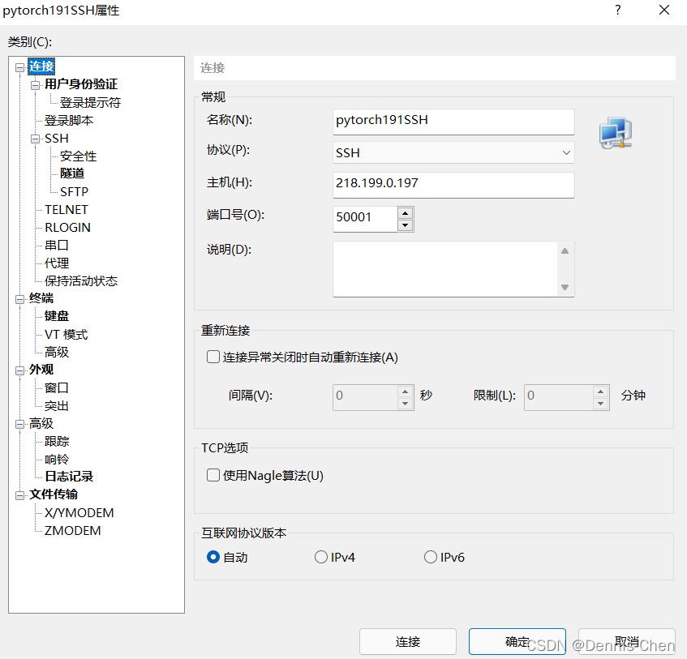
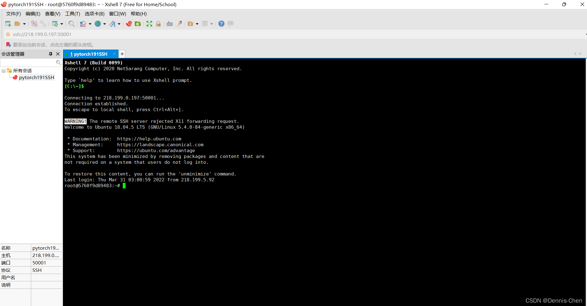

# docker SSH connection

## 1.进入docker

> passwd # add root passward 记住自己设置的密码，后面ssh连接要用
>
> apt update
>
> apt install vim openssh-server
>
> service ssh start
>
> service ssh status
>
> ps -e |grep ssh


**正常现象为：**






```bash
vi /etc/ssh/sshd_config
```


## 2.修改SSH配置文件 修改下面几行

>PermitRootLogin yes #root能使用ssh登录
>
>PubkeyAuthentication yes #启用公钥私钥配对认证方式
>
>AuthorizedKeysFile .ssh/authorized_keys #公钥文件路径（和上面生成的文件同）
>
>UsePAM no


## 3.重启SSH服务

```bash
service ssh restart
service ssh status
```


## 4.退出容器并保存更改

```bash
exit
docker commit -m 'install openssh' -a 'Docker li_SSH' 556e540e7280 pytorch191:pytorch191SSH
```

> 注: -m 来指定提交的说明信息，跟我们使用的版本控制工具一样；-a 可以指定更新的用户信息；之后是用来创建镜像的容器的ID；最后指定目标镜像的仓库名和 tag 信息。创建成功后会返回这个镜像的 ID 信息。





## 5.启动新的容器

将新的镜像启动，并将docker服务器的50001端口映射到容器的22端口上：

```bash
docker run -it --name="cuda" --gpus=all -p 50001:22 pytorch191:pytorch191SSH /usr/sbin/sshd -D
```

或者

```bash
docker run -it --name="cuda" --gpus=all -p 50001:22 pytorch191:pytorch191SSH /bin/bash
service ssh start 
```

查询 服务器ip (例:218.199.0.197)



## 6.打开XShell 新建



> 用户名:root
> 密码:(本文第一步操作设置的密码)
> 点击确定
> 即可成功连接



有可能会出现: `nvcc -V` 无显示

**解决docker容器使用ssh连接时，无法调用GPU问题**

永久使用环境变量：在/etc/profile文件中追加

```bash
export $(cat /proc/1/environ |tr '\0' '\n' | xargs -0)
```

