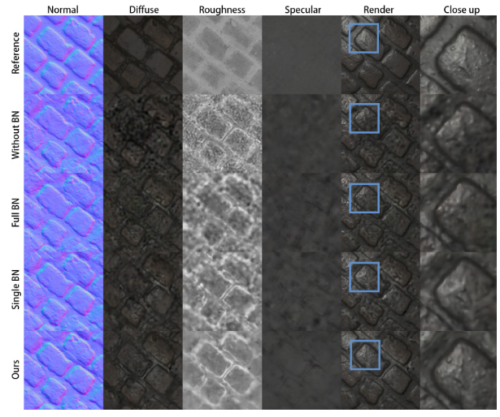

# Paper reading and code reproduction records

[TOC]


## 0.`Single-Image SVBRDF Capture with a Rendering-Aware Deep Network`

### 0.1 目的动机


### 0.2  主要思想


### 0.3  实验--代码复现 [code](https://github.com/valentin-deschaintre/Single-Image-SVBRDF-Capture-rendering-loss) [项目主页](https://team.inria.fr/graphdeco/projects/deep-materials/)


------

## 1.`Deep Inverse Rendering for High-resolution SVBRDF Estimation from an Arbitrary Number of Images`[ACM SIGGRAPH 2019 Q1]


### 1.1 目的动机

#### 1.1.1 现阶段缺点:

​		**传统纹理材质建模**:主要对目标材质样本进行**大量图像采集**，并进行数据驱动建模。这样就要求这大量的图像，要包含**不同光照**、**视角**等等(即:图片要与纹理模型的本征自由度有关)，大量图片才能保证不出现二义性。

​		传统的优化重建之所以会在系统欠定时产生非常不合理的结果，重要原因正是因为其**解空间**中包含了大量不符合真实世界纹理材质分布的情况。


​		**深度学习的方法：**<u>通过神经网络从单张输入图片来预测纹理材质的方</u>法。深度学习可以充分利用训练数据中真实世界的材质属性的分布信息，即使存在二义性，也可以根据先验知识给出“合理”预测。这里的“合理”表示预测的纹理材质看起来和实际测量目标的纹理材质非常相似，并且不存在明显的瑕疵(artifacts)，但是，这种预测的结果不一定能精确反应实际测量目标的材质属性。【**单张图片并不一定能反映材质的全部属性**，例如:在不同光照条件下，神经网络通过预测的纹理材质就可能存在偏差】<u>当前基于深度学习的方法，尚不能利用更多图像信息来进一步改进这一“合理”的预测结果。</u>

#### 1.1.2 目标

​		本文的目标就是要设计一种纹理建模的方法，将基于深度学习的方法和传统重建方法的优势相结合，并且给定**任意数量的输入**，均可进行纹理材质建模。当输入图片数量较少，并不能完全确定目标样本的完整材质属性时，算法会给出一个“合理”的建模结果，而且能够随着输入图片的增多越来越精确，最终收敛到一个准确的材质重建结果上。


[]


### 1.2  主要思想

#### 核心思想:

**------   <u>利用深度学习建立一个纹理材质的本征空间，在这个本征空间上进行优化重建;</u>**

​		传统的优化重建之所以会在系统欠定时产生非常不合理的结果，重要原因正是因为其解空间中包含了大量不符合真实世界纹理材质分布的情况。而通过深度学习，建立一个真实世界纹理材质的本征空间，可以极大地避免产生不合理的结果。同时，由于整体算法依然符合优化重建的框架，因此可以自然地支持不同数量的输入，解决传统深度学习方法仅能获得“合理”预测的问题。


针对核心思想要解决的问题:

- 如何建立一个适合优化重建算法的本征空间？

  ------**本文提出了一种改进的 Autoencoder 训练方法来训练纹理材质的本征空间**。我们设计的 Autoencoder 网络仅在**本征编码**(Latent code)之前采用了一个特殊的归一化 Normalization 层，并对本征编码空间提出空间连续性限制。这一空间连续性项使得在本征空间中相邻的点与外观上相似的纹理材质相对应，保证了本征空间的连续性，有利于优化重建算法在本征空间中进行连续的搜索。

  

- 如何为优化重建算法提供初始化？

  ------利用现有的基于深度学习的单张图片纹理材质预测的方法，将预测到的纹理材质通过 Autoencoder 中的编码器得到对应的本征编码，以这个本征编码作为初始值来进行优化。


#### Autoencoder 设计与训练


### 1.3  实验--代码复现 [code](https://github.com/msraig/DeepInverseRendering) [作者首页--高端](https://gao-duan.github.io/)

#### 1.3.1 输入&&输出&&数据集

- 输入：1-n pics

- 输出:  Normal、Diffuse、Roughness、Specular、Render

  

- 数据集：(**不详**)


#### 1.3.2 训练&&测试

##### 训练

代码不详

##### 测试

1. ###### (captured images as input)

   ```bash
   python3 main.py --N 20 --checkpoint ../model/ --dataDir ../example_data/example_svbrdf --logDir ../log_test_example_20221030_pic --initDir  ../example_data/example_init --network network_ae_fixBN --init_method svbrdf --input_type image --wlv_type load --wlvDir ../example_data/example_wlv
   ```

   

2. ###### (SVBRDF map as input)

   ```bash
   python3 main.py --N 20 --checkpoint ../model/ --dataDir ../example_data/example_svbrdf --logDir ../log_test_example_20221030 --initDir  ../example_data/example_init --network network_ae_fixBN --init_method svbrdf --input_type svbrdf --wlv_type load --wlvDir ../example_data/example_wlv
   ```

   

----------------------


## 2.`Flexible SVBRDF Capture with a Multi-Image Deep Network`


## 3.`Highlight-Aware Two-Stream Network for Single-Image SVBRDF Acquisition`

### 3.1 目的动机

​		在虚拟三维场景内容创建过程中，材质的高质量重建向来是一个复杂耗时的工作。传统的材质重建方法通常需要依赖特殊的设备、受过专业训练的技术员以及长时间的拍摄。	而本次设计的双流网络，只需要消费级别的相机（手机等），并且只需要拍摄一张图片，即可由非专业人员重建出高质量的材质参数。其中，**双流网络**以HA卷积为基础，其中HA卷积的作用是：在过度曝光的图像区域填补缺失内容；因此，双流网络可以充分利用图像的有用特征，促进材质属性的解缠学习。这也正是本篇论文的关键性创新。


### 3.2  主要思想

#### 核心思想:

​		从深度学习出发，用神经网络结合大量数据，尝试在未知的空间变化情况下，完成平面材质的外观建模。论文中的方法仅采用了单张图片作为输入，不需要相机参数和光源参数，就能输出高质量材质参数.


####  解决的难点

##### 1.如何解决图像过曝问题？

​		由于过曝区域无法估计，采用让网络自学习判别过曝区域，并修复。

##### 2.如何解决模型过拟合？

​		训练数据集包含18万张图片，可以比较好地避免过拟合的问题。

​		由于材质估计是具有二义性的，即不同的SVBRDF 也有可能生成一样的材质图，所以研究人员训练loss中包含render loss ，即估计的材质贴图与ground truth 在同样的光照条件下渲染出材质图做L1 loss。这样即表示不那么强调材质贴图的完全一致，可以有效缓解过拟合问题。

##### 3.如何解决diffuse 和specular 贴图的解缠效果差？

​		使用多解码器以及其中的AFS模块，多解码器是为了让每个解码器可以在high level 特征提取时就通过AFS 模块着重提取对应的贴图需要的特征，以达到解缠目的。


### 3.3  实验--代码复现

#### 3.3.1 输入&&输出&&数据集

- 输入：

- 输出:  

  

- 数据集：(**不详**)


#### 3.3.2 训练&&测试 [Code](https://github.com/happyvictor008/Highlight-Aware-Two-Stream-Network-for-Single-Image-SVBRDF-Acquisition)

##### 训练

```bash
python HATW_net.py --mode train --output_dir ./output_dir/20221031 --input_dir ../Data_Deschaintre18/trainBlended --batch_size 1 --loss adv --useLog
```


##### 测试


