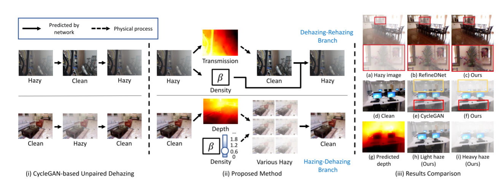

# Paper reading and code reproduction records--highlight removal

----

## 0.CVPR 2022 无监督去雾--Self-augmented Unpaired Image Dehazing via Density and Depth Decomposition

为了克服在合成的模糊图像对上训练的去雾模型的过拟合问题，许多最近的方法试图通过训练非配对数据来提高模型的泛化能力。它们大多只是简单地制定去雾和加雾 cycles，而忽略了现实世界雾霾环境的物理特性，即雾霾随密度和深度的变化而变化。

本文提出了一种自增强的图像去雾框架，称为 D4 (Dehazing via Decomposition, transmission map into Density and Depth)，用于生成和去除雾霾。该框架不只是估计传输图或干净的内容，而是专注于探索模糊和干净图像中包含的散射系数和深度信息。在估计场景深度的情况下，本文的方法能够重新渲染不同厚度的模糊图像，这进一步有利于去雾网络的训练。值得注意的是，整个训练过程只需要不配对的模糊图像和干净的图像，但成功地从单一的模糊图像中恢复散射系数、深度图和干净内容。

