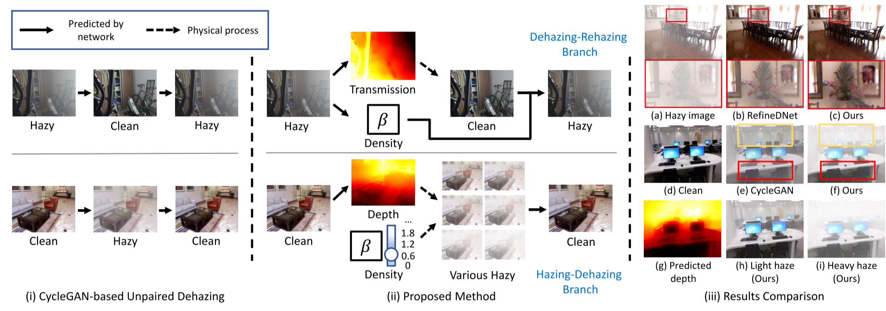
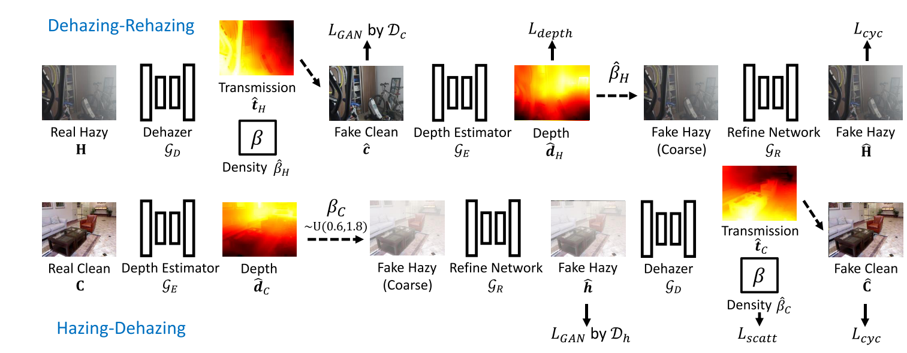
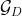
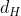
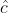
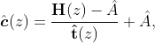

# Paper reading and code reproduction records--highlight removal

----

[TOC]

## 0.CVPR 2022 无监督去雾--Self-augmented Unpaired Image Dehazing via Density and Depth Decomposition

### 现有缺点：

​		现有合成数据集在训练中存在**过拟合**问题

​		由此最近的一些方法就通过训练非配对的数据来提高模型的泛化能力(cyclegan -- A域->B域)；但大都是简单的指定加入去雾&加雾，而忽略了现实世界雾霾环境的物理特性，即雾霾随密度和深度的变化而变化。

>​		**<u>CycleGAN 是一个被广泛采用的用于非配对图像到图像转换的框架</u>**。一方面，利用 GAN 损失来加强图像在两个域之间的转换。另一方面，周期重构损失很好地维持了内容的一致性。对于图像去雾，基于 cyclegan 的方法通常包含去雾网络和加雾网络，分别从对应的预测干净图像和雾图像。
>
>​		本文认为这种做法可能是有问题的。在这些方法中忽略了两个关键性质，**深度**和**密度**。因此，生成的雾霾通常缺乏真实感和多样性，这进一步影响了去雾网络的学习。
>
>​		为了解决这些问题，提出了一种新的非配对去雾框架，称为 D4 (通过将传输图分解为密度和深度去雾)。

​	

### 本文核心思想

​		本文提出了一种自增强的图像去雾框架，称为 D4 (Dehazing via Decomposition, transmission map into Density and Depth)，用于**生成和去除雾霾**。该框架不只是估计传输图或干净的内容，而是专注于探索模糊和干净图像中包含的散射系数和深度信息。在估计场景深度的情况下，本文的方法能够重新渲染不同厚度的模糊图像，这进一步有利于去雾网络的训练。值得注意的是，整个训练过程只需要不配对的**模糊**图像和**干净**的图像，但成功地从单一的模糊图像中恢复散射系数、深度图和干净内容。

​							本文提出的网络d4的体系结构。整个网络包括除雾修复分支和HazingDehazing分支。在雾霾生成中同时考虑深度和密度信息。引入了两对伪监督来确认估计深度和散射系数的准确性。

### 优势

​		整个训练过程仅依靠非成对的有雾图像和清晰图像，成功地从单个模糊图像中恢复了散射系数、深度图和清晰图像。综合实验表明，我们的方法在参数量和FLOPs更少的情况下去雾效果优于最先进的非成对去雾方

### 整体框架--简析

**D4框架**由三个网络组成:**去雾网络** 、**深度估计网络**  和**细化网络** 。

#### The dehazing network

 是从雾图像中估计透射率  和衰减系数 ，其表达式为:

由估计的透射率 和散射系数可以计算出朦胧图像的深度图 d，公式为:

#### The depth estimation network

 的目标是从一个干净的图像 C 中估计深度，其公式为：

深度估计网络与其他单个图像深度估计网络具有相同的功能，但本文在训练过程中没有使用任何来自现有深度估计器或 GT 深度监督的预训练权值。在本文的 D4 框架中，使用去雾网络的伪监督（pseudo supervision)训练网络 ，更多的细节在第 3 节中介绍。

#### The refine network

 与以往基于 cyclegan 的方法 (从输入的干净图像直接合成模糊图像) 不同，提出的 D4 通过考虑两种物理特性 (**密度**和**深度**) 来建模重建过程。具体地说，

首先，通过结合清晰图像、深度估计和散射系数得到一个粗糙的伪模糊图像。

然后，细化网络作为一个图像到图像的转换网络，将粗糙的伪雾图像映射到遵循真实雾图像分布的雾图像，即

也就是说，所提出的细化网络可以看作是进行了一种有条件的雾图像生成。考虑到深度和密度信息，精细网络旨在生成视觉上逼真的雾图像。

在提出的 D4 框架中，去雾网络 和深度估计网络  都是基于 EffecentNet -lite3 **[43]** 结构，细化网络具有 UNet 结构。补充材料中提供了详细的网络架构。

[**43**] [EfficientNet: Rethinking model scaling for convolutional neural networks](https://proceedings.mlr.press/v97/tan19a/tan19a.pdf). **ICML, 2019**

### 训练过程

D4 网络训练包含两个分支:(i) Dehazing-Rehazing 分支和 (ii) Hazing-Dehazing 分支。

#### The Dehazing-Rehazing branch

将雾图像 H 输入到去雾网络中，可以得到估计的透射图，估计的散射系数  和计算的深度。同时，去雾结果可以通过:

其中 是由先验估计的大气光。

利用去雾图像 ，深度估计器  从中预测深度 。

然后，用之前估计的散射系数  和估计的  恢复去雾图像 。

首先，推导出一个粗糙的带有雾霾形成过程的雾图像 :

其中采用最亮的像素作为大气光 A 来生成雾霾。

然后，对粗糙的雾图像  进行细化网络处理，得到最终的图像 。

#### The Hazing-Dehazing branch

在这个分支中，从集合  中采样一个干净的图像 C。深度估计网络  用于从图像 C 中估计深度图 ，然后，从预定义的均匀分布中随机抽样一个 。按照公式 7 所示的相同物理过程，推导出可变雾密度的粗糙雾状图像 ，即:

然后利用精细网络合成伪雾图像，再通过去雾网络进行进一步的处理，预测其透射率，散射系数 。

最后，可以使用公式中给出的相同计算来重建干净的输入。

值得注意的是，在这个分支中，由于  是从一个预先定义的范围中采样的，加雾过程可以被视为去雾网络后续训练的数据增强操作。

